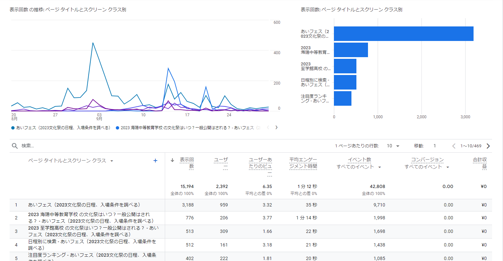

# あいフェス

使用技術: PHP, WordPress

URL

[あいフェス（2023文化祭の日程、入場条件を調べる）](https://aifes.net/)

公式Instagram

Github

[https://github.com/yamaneko05/aifes2023](https://github.com/yamaneko05/aifes2023)

### 概要

愛知県内の高校の文化祭を調べられるサイトを制作、運営しました。

同年代の友人と企画して文化祭の情報収集やSNSアカウントの投稿など役割分担をして自分は開発を担当しました。

多くの高校生から関心を集められるサイトにするために各高校ごとにいいねやコメント機能をつけたり高校のランキング表示などを作りました。

SEO対策、SNSの投稿なども行いPVを増やすための工夫を行い、ピーク時には月間約1万PVを獲得しました。（現在でも「あいフェス」や「○○高校 文化祭」などで検索すると表示されます）

２度の審査を経てGoogleAdsenseに合格し広告の掲載を開始しましたが、合格したころには文化祭のピークである9月~11月の大半が過ぎており引き出し下限額である8000円に到達することはできませんでした。

### まとめ

- 前職ではシステム開発のほかにWordPressサイトの開発や保守管理の業務もあったのでWordPressで実装した
- 管理画面から文化祭のデータの作成・編集を行えるようにして、メンバーの誰でもデータの管理をできるようにした
